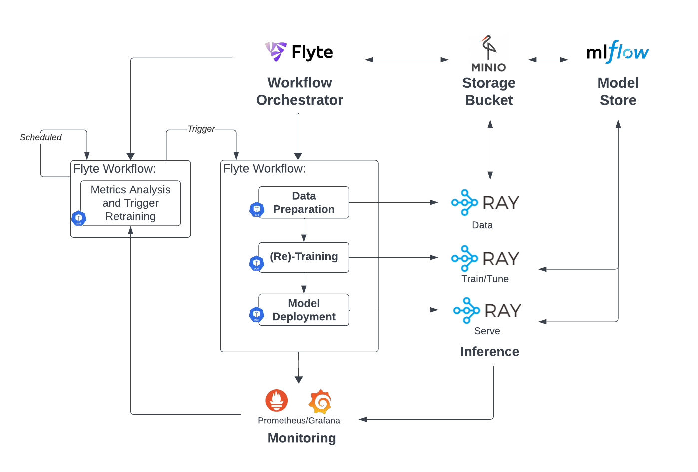
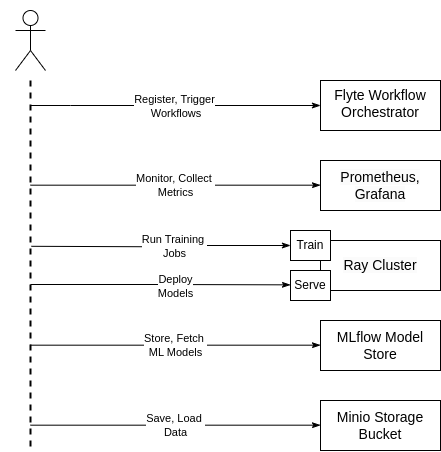

# Self-Evolving AI/ML Workflow


### Minimal requirements:
12 CPUs
32GB RAM

### Deployment:
- Run install script `./scripts/system-install.sh` which installs microk8s and addons.
- (Optional) Run install script `scripts/rasp-install.sh` on any raspberry pi node you want to join to the cluster.

- Deploy with helm, adjust configs in `values_example.yaml`:

```bash
helm add repo semr_charts https://copandrej.github.io/SEMR_charts/
helm install semr semr_charts/SEMR --values values_example.yaml
```
- Run config script `./scripts/env-prepare.sh` on VM to install requirements and connect flytectl to the cluster for running AI/ML workflows.


### Usage:


## Project

`workflow_examples/`
Examples of full MLOps pipelines


`scripts/`
Install & configure scripts for the system DEPRECATED

## Architecture




